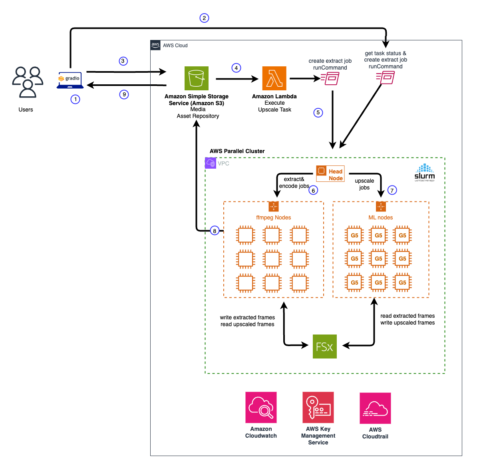
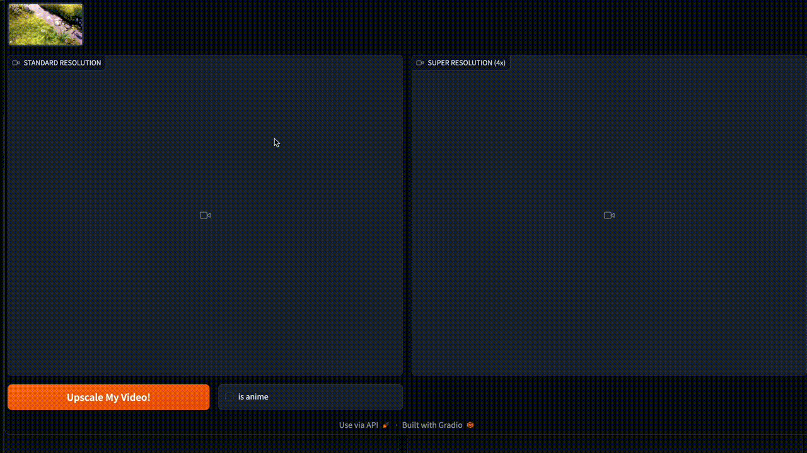

## Generative AI Video Super Resolution 
Build a highly scalable and performant solution for Video Super Resolution with Generative AI models using HPC and serverless architecture in AWS.


## Overview
Today, media and entertainment companies own a large number of archived media contents that were created in low or standard resolutions before high-resolution technology was available. For instance, movies, music videos, and sports highlight clips. Given today's display technology advancements, it's common for the audience to demand video content to be delivered in high definition, such as HD or 4K, for an enhanced viewing experience on larger screens. There is an opportunity to increase revenue by making the legacy media assets available in higher resolutions (HD, 4K, or higher).

Standard approaches for upscaling video content involve complex processes, including frame interpolation, denoising, filtering, post-processing, and others. Two notable approaches for upscaling video resolutions are: 

1. Using COTS (Commercial Off-The-Shelf) licensed products 
2. Building a video upscaling pipeline using open-source tools like FFmpeg. 

Using COTS products could be costly due to licensing costs. Additionally, it presents major challenges when a large number of media contents require video upsampling. Despite COTS products offering streamlined approaches for video upscaling tasks, these products are built using proprietary technology and vendor lock-in. On the other hand, leveraging open-source tools could be an alternative that provides better flexibility and control, but the results could be inconsistent. Recent advancements in Deep Learning and Generative AI technology have made super-resolution images through AI possible. These models are trained with millions of images that learn common patterns for high resolution. These models are ideal for achieving upscaled image quality at scale through a single pass without explicit steps for denoising, filtering, and so on. Generative AI techniques, such as Generative Adversarial Networks (GANs), Vision Transformers and Stable Diffusion are considered the front runners when it comes to AI image super-resolution task. In this repository, we share an end-to-end solution that uses Real-ESRGAN, SwinIR, and is coupled with AWS services to orchestrate a workflow that takes low-resolution videos as input and produces 4x resolution videos in minutes. The solution could be used to automate the process of super resolution for media contents at scale.

## Architecture
The solution is built with AWS services focused on three main steps: 1) Video analysis and frame extractions, 2) AI model upscaling, and 3) Constructing super-resolution videos with content generated by AI. Given the possibility of producing a large number of frames from the input video, the video upscaling workflow must be designed with scalability and performance as a priority. Our solution uses AWS ParallelCluster with the Slurm scheduler to orchestrate all the steps mentioned above. In particular, we leverage the Slurm scheduler and management tools to provide autoscaling and task allocations based on CPU, Memory, and GPUs to achieve maximum scalability and performance. Additionally, we use Amazon FSx Lustre as a shared file system across all compute nodes to optimize the I/O throughout the video upscaling workflow. After testing various AI models, we settled on the RealESRGan and SwinIR models to provide the most consistent and optimal results across various media contents, including animations, movies/shows, music videos, and so on. The AI upscaling capabilities are delivered via SageMaker endpoints made available on the compute nodes. We provide an architecture diagram that depicts the end-to-end workflow.




## Step By Step Guide
The following section contains the detail about how to setup a video super resolution solution in your own AWS environment.

### Prerequisites

* A development environment with docker installed. (This solution has been tested in a SageMaker notebook instance with g5.2xlarge instance type)
* Permission to access to ECR with create repository and push docker images to the registry
* Clone the repository: git clone https://github.com/aws-samples/genai-video-super-resolution
* An S3 bucket where the media contents, scripts and other dependencies are stored.

### Working With Real-ESRGAN Model 
The following steps walkthrough the process of building a docker image packaged with Real-ESRGAN Model and push to ECR.

```
cd realesrgan
./build_and_push_docker.sh -a [aws account number] -r [aws region name]
```

The resulting docker image will be <aws-account-nbr>.dkr.ecr.<aws region name>.amazonaws.com/genai-realesrgan-4x-super-resolution:latest

#### Deploy Model Endpoint Locally For Testing

First, create an endpoint locally:
```
docker run -d --gpus all --name realesrgan -v $PWD/test:/videos/test -p8889:8080 <aws-account>.dkr.ecr.<aws-region>.amazonaws.com/genai-realesrgan-4x-super-resolution serve
```

#### Test
```
cd test && ./test.sh
```

Verify the upscaled version of the image is created under HD/frames directory.


### Working With SwinIR2 Model
The following steps walkthrough the process of building a docker image packaged with Swin2SR model and push to ECR.
```
cd swinir2
./build_and_push_docker.sh -a [<aws account number>] -r [<aws region name>]
```

The resulting docker image will be <aws-account-nbr>.dkr.ecr.<aws region name>.amazonaws.com/genai-swinir2-4x-super-resolution:latest

#### Deploy Model Endpoint Locally For Testing

First, create an endpoint locally:
```
docker run -d --gpus all --name swinir2 -v $PWD/test:/videos/test -p8888:8080 <aws-account>.dkr.ecr.<aws-region>.amazonaws.com/genai-swinir2-4x-super-resolution serve
```

#### Test
```
cd test && ./test.sh
```

Verify the upscaled version of the image is created under HD/frames directory.  

### Performance Optimization (Experimentation)
Vision Transformer models, like Swin2SR can be compiled into tensorrt format (TRT) to achieve better throughput. Follow this [link](swinir2-tensorrt/README.md) for more information about using the optimized version of the model to support the video super resolution pipeline. Please note this is an experimental feature. The optimized model could achieve 30% throughput improvement over the original format, with potential slightly reduced upscaled quality. If the upscaled quality is important, we recommend using the torch model instead.


### Setting up an AWS ParallelCluster
#### Prerequisites

1. A VPC  (At least 1 private subnet with enough ip addresses for all compute nodes and 1 public subnet)
2. An S3 bucket for storing relevant scripts needed for upscaling tasks. This bucket could be the same as the one used for storing media content. 
3. A key pair for accessing ParallelCluster head node via SSH: https://docs.aws.amazon.com/parallelcluster/latest/ug/set-up-keypair.html

#### Creating a new ParallelCluster

1. Install ParallelCluster CLI by following the link here: https://docs.aws.amazon.com/parallelcluster/latest/ug/install-v3-parallelcluster.html
2. Prepare a custom AMI that enables GPU support with AWS ParallelCluster components
```
cd pcluster
pcluster build-image --image-id genai-video-super-resolution-base-gpu-ami --image-configuration config/image_config.yaml --region [aws-region]
```

*Note:* The custom AMI in the repository is based on the public AMI in `us-east-1` region with AMI name: "Deep Learning AMI GPU PyTorch 2.0.1 (Amazon Linux 2) 20230926". To find the corresponding AMI for your region, go to EC2 console, then click on AMIs, then select `public images` from the drop down, and paste the Deep Learning AMI string above. If you want to use a different base AMI, replace the AMI id in pcluster/config/image_config.yaml with the id that you would like the custom AMI created for. 

The image creation process takes about 45 minutes to complete. To check the status, run the following ParallelCluster CLI command:
```
pcluster describe-image --image-id genai-video-super-resolution-base-gpu-ami --region [aws-region]
```

Example output: 

```json
Output: {
"image": {
"imageId": "genai-video-super-resolution-base-gpu-ami",
"imageBuildStatus": "BUILD_IN_PROGRESS",
"cloudformationStackStatus": "CREATE_IN_PROGRESS",
"cloudformationStackArn": "arn:aws:cloudformation:us-east-1:123456789012:stack/genai-video-super-resolution-base-gpu-ami/1b9ac3b0-6166-11ee-9954-0ea475d68c23",
"region": "us-east-1",
"version": "3.6.1"
}
}
```

When the custom AMI creation is complete, the response from the CLI command above looks like the following:
```
{
"imageConfiguration": {
"url": "https://parallelcluster-a173c96cd90988cf-v1-do-not-delete.s3.amazonaws.com/parallelcluster/3.6.1/images/genai-video-super-resolution-base-gpu-ami-2sww4w0awu7you72/configs/image-config.yaml?AWSAccessKeyId=..."
},
"imageId": "genai-video-super-resolution-base-gpu-ami",
"creationTime": "2023-10-02T21:36:37.000Z",
"imageBuildStatus": "BUILD_COMPLETE",
"region": "us-east-1",
"ec2AmiInfo": {
"amiName": "genai-video-super-resolution-base-gpu-ami 2023-10-02T20-59-05.820Z",
"amiId": "ami-0c589cf2192959fb8",
"description": "AWS ParallelCluster AMI for alinux2, kernel-5.10.192-183.736.amzn2.x86_64, lustre-2.12.8-2.amzn2.x86_64, efa-2.5.0-1.amzn2.x86_64, dcv-2023.0.15022-1.el7.x86_64, nvidia-535.54.03, cuda-12.1.20230417",
"state": "AVAILABLE",
"tags": [
{
"value": "0.5.15",
"key": "parallelcluster:munge_version"
}...
```

Make a note of the ```amiId``` value in the response JSON above, you'll need it in the next step.

3. Install bootstrap scripts For ParallelCluster HeadNode and Compute Nodes
```
cd pcluster/bootstrap
./prepare.sh -a [aws account where the bootstrap scripts will go] -r [aws region] -s [s3 location path (URI) where the source video contents will be uploaded] -d [ s3 location path (URI) where the upscaled videos will be stored] -b [s3 bucket name where the bootstrap scripts are located. DO NOT include s3://]

./install.sh [the s3 bucket name where the bootstrap scripts will be stored. DO NOT include s3://]
```

The result of running the bash script above would upload the bootstrap scripts to S3. These scripts will be consumed by the HeadNode and the ComputeNodes when it's launched for processing. 

*Note:* Make a note of the S3 location of the scripts  (e.g. s3://xyz-parallel-cluster/bootstrap/compute-node-configured.sh for GPU compute node and s3://xyz-parallel-cluster/bootstrap/compute-node-cpu-configured.sh for CPU compute node). These script locations are to be used in the next step.


4. Create the ParallelCluster configuration file. 
```
cd pcluster/config
 ./install.sh -s [s3 bucket name (DO NOT INCLUDE s3://) where the cluster nodes should be given access to] -k [ssh keypair name to use]  -v [private subnet ID] -u [public subnet ID]  -b [gpu compute node bootstrap script s3 location] -d [cpu compute node bootstrap script s3 location] -n [head node bootstrap script s3 location] -g [custom ami for the gpu compute node] -r [aws region]
}
```

An example cluster config yaml is created upon a successful run:
```
Parallel cluster config file created successfully. The config file location is: /tmp/cluster-config.yaml
```

*Note:* Make a note of the location of the cluster-config.yaml file. E.g. /tmp/cluster-config.yaml. This file is to be used in the next step.

5. Create a new ParallelCluster
```
pcluster create-cluster --cluster-name [name of the cluster] --cluster-configuration /tmp/cluster-config.yaml
```

Example output: 
```
output: {
"cluster": {
"clusterName": "test-cluster",
"cloudformationStackStatus": "CREATE_IN_PROGRESS",
"cloudformationStackArn": "arn:aws:cloudformation:us-east-1:123456789012:stack/genai-video-super-resolution-test-20231002/be2333b0-6175-11ee-8469-0a070c0a2e1b",
"region": "us-east-1",
"version": "3.6.1",
"clusterStatus": "CREATE_IN_PROGRESS",
"scheduler": {
"type": "slurm"
}
}...
```

The cluster provisioning process takes about 30 minutes. To describe cluster status, run the following command:

```
pcluster describe-cluster --cluster-name [name of the cluster]
```

An example output from a successful cluster creation run:
```
...
"cloudFormationStackStatus": "CREATE_COMPLETE",
"clusterName": "test-cluster",
"computeFleetStatus": "STARTED",
"cloudformationStackArn": "arn:aws:cloudformation:us-east-1:123456789012:stack/test-cluster/9f2ea6a0-385e-11ee-a631-0aaaad7cc485",
"lastUpdatedTime": "2023-10-06T00:28:44.591Z",
"region": "us-east-1",
"clusterStatus": "CREATE_COMPLETE",
"scheduler": {
"type": "slurm"
}
}
```

### Deploy Lambda Function for Serverless Event Handling
When a video content is uploaded to S3 bucket, an S3 event is trigger to kick off the upscaling pipeline process. For this, we use a lambda function as the handler for the process. This repository provides a cloudformation template for provisioning the lambda function and the associated event hook for a given S3 bucket location. To launch the cloudformation stack, you can use the console, or AWS CLI. Simply provide the following parameters to CloudFormation at provisioning time:

* Source Video S3 Bucket Name - This is the name of an S3 bucket where your source video content will be uploaded. For instance: *my-video-super-resolution-bucket*
* SourceVideoS3PrefixFilter - The S3 Prefix that the lambda function is configured to trigger when a new object is created. For instance: *data/orig/*
* ParallelCluster HaedNode EC2 Instance Id - This is the EC2 instance ID for the head node provisioned in the previous step. For instance: *i-0cba84219683f31c9*
* Upscaled Video Output S3Location - The S3 location where the upscaled video will be stored. For instance: *s3://my-video-super-resolution-bucket/data/final/*
* SSM Result bucket name - the name of the S3 bucket where the SSM output will be stored. For instance: *my-video-super-resolution-bucket*


```
cd lambda
aws cloudformation create-stack --stack-name video-super-res-lambda-stack --template-body file://${PWD}/video_super_resolution.yaml --parameters ParameterKey=SourceVideoS3BucketName,ParameterValue=[s3 bucket name] ParameterKey=SourceVideoS3PrefixFilter,ParameterValue=[S3 Prefix to filter a lambda function trigger] ParameterKey=ParallelClusterHeadNodeEC2InstanceId,ParameterValue=[head node EC2 instance id] ParameterKey=VideoOutputS3Location,ParameterValue=[s3 location path] ParameterKey=SSMResultS3BucketName,ParameterValue=[s3 bucket name] --capabilities CAPABILITY_IAM
```

The stack should take about 1 minute to finish. You can check the status in the [Cloudformation Console](https://console.aws.amazon.com/cloudformation)


### Building and launching a Demo User Interface For Video Super Resolution
To test the video super resolution pipeline described above, we built a sample UI component to orchestrate the end to end process. This demo UI is a [Gradio](https://gradio.app/) based application. Users can also access the upscaled video after the workflow is complete. To run the demo, you would also need to provide an appropriate AWS credentials that has the following policy attached:

* SSMFullAccess or a custom policy with permission to [send commands](https://docs.aws.amazon.com/systems-manager/latest/APIReference/API_SendCommand.html). 


```
cd ui
docker build -t video-super-resolution-ui .
docker run -d -e AWS_DEFAULT_REGION=[AWS region] -e AWS_ACCESS_KEY_ID=[aws access key] -e AWS_SECRET_ACCESS_KEY=[aws secret key] -e AWS_SESSION_TOKEN=[aws session token] -e GRADIO_USERNAME=[a unique username] -e GRADIO_PASSWORD=[a unique password] -e S3_BUCKET=[s3 bucket name for storing video content] -e HEAD_NODE=[the headnode EC2 instance ID ] -p 7860:7860 video-super-resolution-ui
```

Launch a web browser and navigate to http://localhost:7860 to access the application.





**Note:** This demo UI is intended for testing purposes only. It should not be used in the production environment.
We recommend [this](https://aws.amazon.com/solutions/guidance/hyperscale-media-super-resolution-on-aws/) solution guidance to learn more about buillding a production ready application in your AWS environment. 


### Headless Testing
In addition to launching the Gradio UI above to perform any video super resolution, you could also test and validate the end to end upscaling wihtout using the UI. To do this, you would do the following step:

* Determine whether the video file is an animation or standard media type (non animation). 
* Upload your media file (mp4) to the S3 path following the source path you had configured in the bootstrap script. The actual source path must follow the convention as followed: 

     i. The prefix must contain the type (either real or anime)

     ii. An uuid that as a unique task ID required by the application. The uuid must follow the output format of the UUID generator from a linux command: `uuidgen` (e.g. cf4f4935-59bc-4fbe-92f1-dc1d4c50ae96)

* For example, assume you have an animation movie and a generated UUID (cf4f4935-59bc-4fbe-92f1-dc1d4c50ae96), your source video would be uploaded to s3://[your video super resolution bucket]/[S3 prefix to source video]/anime/[unique UUID]/ to align the path with your bootstrap script.
* Assume you have an drama movie and a generated UUID (cf4f4935-59bc-4fbe-92f1-dc1d4c50ae97), your source video would be uploaded to s3://[your video super resolution bucket]/[S3 prefix to source video]/real/[unique UUID]/ to align the path with your bootstrap script.
* An example path: *s3://mytest-video-super-resolution/data/src/real/cf4f4935-59bc-4fbe-92f1-dc1d4c50ae96/*
* If the job runs successfully, the upscaled video would be written to the S3 location where you've configured as the destination in the bootstrap script. For example, *s3://mytest-video-super-resolution/data/final/cf4f4935-59bc-4fbe-92f1-dc1d4c50ae96/*

## Clean Up
If you are done experimenting with the video super resolution solution, simply remove the cluster with a single command as followed:

```pcluster delete-cluster --cluster-name CLUSTER_NAME --region REGION
   aws cloudformation delete-stack --stack-name STACK-NAME
```


## License
N.B.: Although this repository is released under the MIT-0 license, its Dockerfile (i.e. Real-ESRGAN)
use the third party Real-ESRGAN project. The Real-ESRGAN project's licensing includes the BSD-3-Clause license.

N.B.: Although this repository is released under the MIT-0 license, its Dockerfile (SwinIR2SR)
use the third party SwinIR2SR project. The SwinIR2SR project's licensing includes the Apache-2.0 license.

N.B.: The Demo Video provided in this repository ([Big Buck Bunny](https://peach.blender.org/about/)) is the result of a Peach Open Project licensed under [Creative Common Attribution 3.0 license](http://creativecommons.org/licenses/by/3.0/). 

